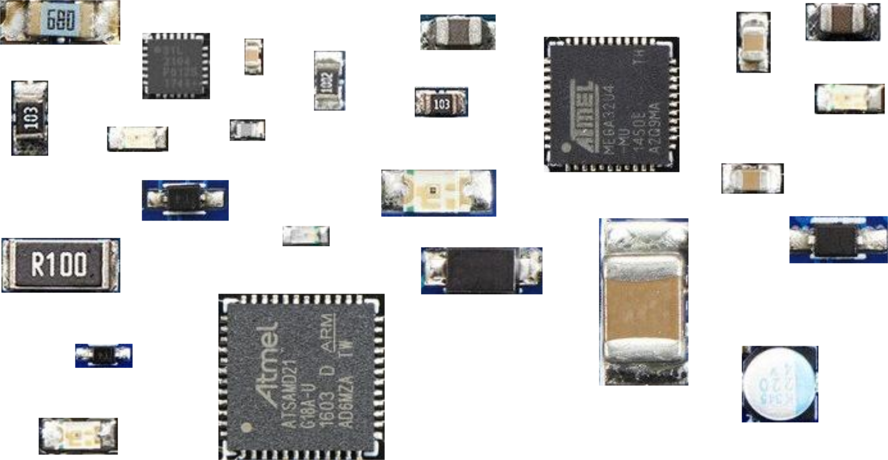
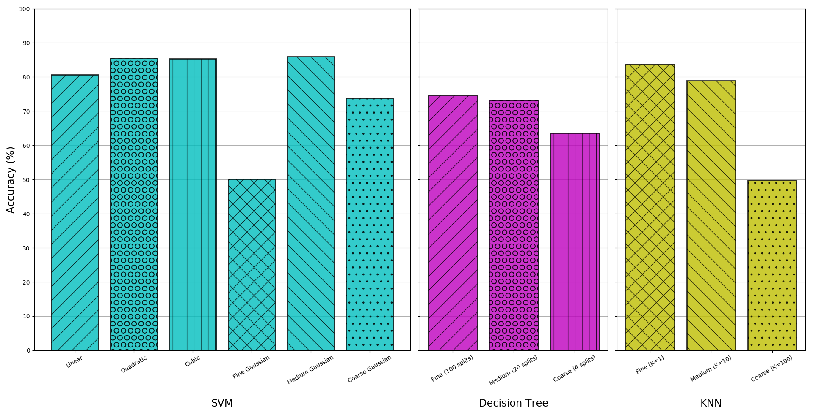
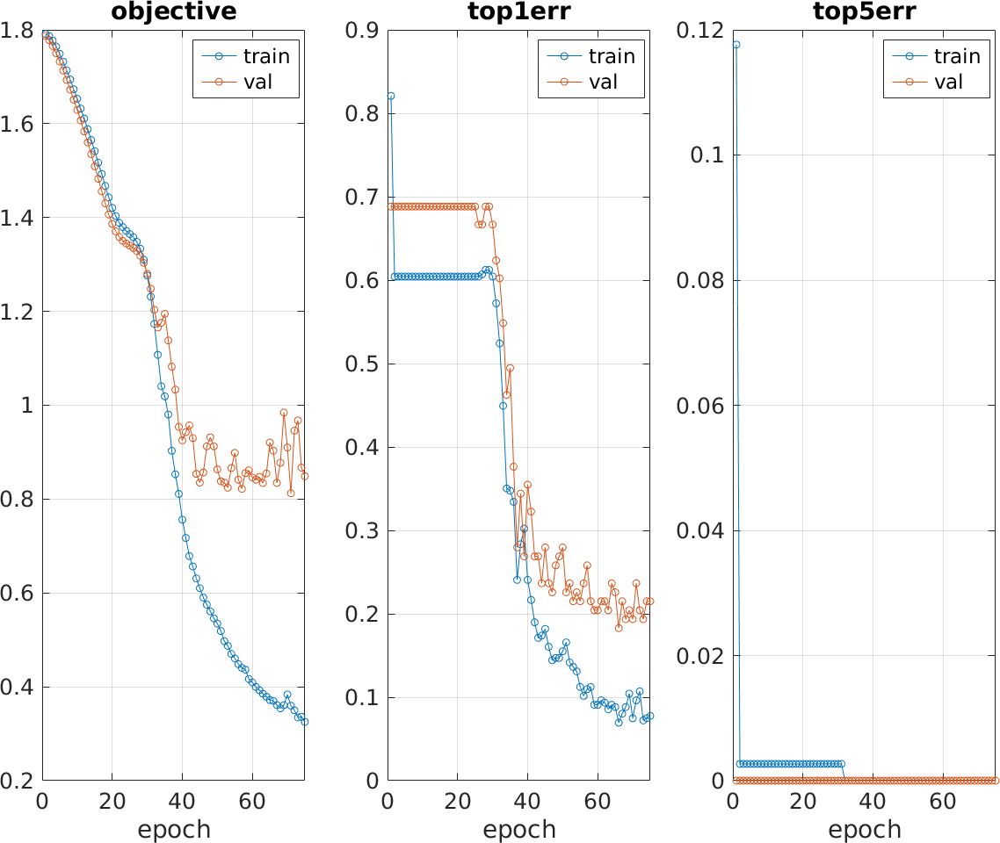

Visual analysis of the components on a printed circuit board (PCB) can provide
additional security and quality assurance. For this reason, we decided to use
existing computer vision techniques to classify PCB components by type
(resistor, capacitor, etc.), achieving around 80% accuracy with the
methodologies we tried.

# Introduction

[Recent events in the field of hardware security](https://www.bloomberg.com/news/features/2018-10-04/the-big-hack-how-china-used-a-tiny-chip-to-infiltrate-america-s-top-companies),
[whether true or not](https://www.zdnet.com/article/super-micro-trashes-bloomberg-chip-hack-story-in-recent-customer-letter/),
have shined light on the issue of ensuring hardware security in a world where
supply chains are not necessarily secure. In that light, ensuring that the
components on a PCB are only those that are supposed to be there can improve
security guarantees and, more prosaically, be useful for quality-assurance
purposes. For this reason, we investigated visual classification of the
components on PCBs using photographs taken with standard cameras using
off-the-shelf computer vision products. Related work in this area includes
defect analysis
[[1](https://research.ijcaonline.org/ncfaaiia/number2/ncfaaiia1014.pdf)]
and identification of specific PCBs for recycling purposes
[[2](https://cvl.tuwien.ac.at/project/reclaim/)].
Such work extends back to at least the 90s as well
[[3](http://citeseerx.ist.psu.edu/viewdoc/download?doi=10.1.1.39.2668&rep=rep1&type=pdf)].

# Methodology
## Dataset Generation

Before we could perform any form of object classification, we needed to find or
generate a dataset of PCB components. We first searched for existing datasets.
The only candidate we found in our search was the [PCB DSLR
Dataset](https://cvl.tuwien.ac.at/research/cvl-databases/pcb-dslr-dataset/) from
[the Computer Vision Lab at TU Wien](https://cvl.tuwien.ac.at/). This dataset
consists of 748 high-resolution images of PCBs from a recycling facility, as
well as segmentation information and bounding boxes. The authors' stated intent
for this dataset is that it be used to "facilitate research on
computer-vision-based Printed Circuit Board (PCB) analysis, with a focus on
recycling-related applications."

Unfortunately, we decided after some review that this would not suffice for our
purposes for a number of reasons.

* First, the dataset only contains segmentation information and bounding boxes
  for large integrated circuits (ICs), such as embedded processors and memory
  controllers. We sought to identify a wider variety of components.
* Next, dust and debris obscure many of the components on the PCBs in these
  images, a result of authors' use of PCBs from a recycling center. This
  complicated our efforts to add our own segmentation information to the
  images.
* Furthermore, the large size of each image (4928x3280 pixels), meant it would
  be difficult to supplement the included labels with our own in a timely
  fashion.
* Finally, without detailed information about the design of the PCBs, we
  realized that we would not be able to generate sufficiently accurate
  annotations on our own.

Faced with these challenges, and with no other strong candidate datasets, we
decided our best course of action involved generating our own dataset. We
identified three criteria that needed to be met for our purposes:

* First, the PCBs in the images needed to contain a variety of components,
  including resistors, capacitors, diodes, inductors, LEDs, and ICs, but not in
  such quantities that hand-labeling them required an unreasonable amount of
  time.
* Next, each PCB needed to be clear of artifacts, whether visual (e.g.,
  blurriness) or physical (e.g., dust).
* Finally, we needed access to a detailed listing of the components on each
  PCB, including their locations on the board, to allow accurate labeling of
  the ground truths for each image.

The third criterion in particular was a source of difficulty for us until we
settled on the use of *open-source hardware* -- hardware designs that include
all of the necessary design files (e.g., EAGLE source files). As a result, we
decided on constructing a database using images of products from [Adafruit
Industries](https://www.adafruit.com/), an open-source hardware company known
for its support of electronic hobbyists. Adafruit provides the EAGLE source
files for most of its internally-designed PCBs, allowing us to hand-label images
of these PCBs with a high degree of accuracy.

We identified six components for classification: resistors (R), capacitors (C),
inductors (H), diodes (D), LEDs (L), and integrated circuits (ICs). For each
image in our dataset, we used [MATLAB's Image Labeler
tool](https://www.mathworks.com/help/vision/ref/imagelabeler-app.html) to
outline these components. The corresponding EAGLE PCB layout files served as our
reference.  From the resulting `groundTruth` objects, we extracted bounding
boxes and cropped each image to generate our actual dataset of component images
iand labels. Examples of the resulting images are shown below:

## Object Classification

With our dataset generated, we moved onto the object classification problem.
After researching the various methods available, we settled on testing two
different approaches and comparing the accuracies. The first approach generated
color histograms for each image and trained a variety of supervised classifiers
using [MATLAB's Classification
Learner](https://www.mathworks.com/help/stats/classificationlearner-app.html)
tool. Specifically, this tool trains and scores the following types of learners
in parallel:

* Decision Trees -- data features used in a trained tree search to classify
* Support Vector Machines -- data separated by hyperplanes based on similarity
* Nearest-neighbor Classifiers -- using nearest-neighbor voting to determine
  similarity

The second approach used a convolutional neural network (CNN) implemented with
[MatConvNet](http://www.vlfeat.org/matconvnet/)
[[4](https://arxiv.org/pdf/1412.4564.pdf)]. Deep neural networks such as CNNs
have wide applications to many fields of research, computer vision included, and
seemed a suitable choice for this project due to their current popularity in the
CV community.

The CNN used was a simple one, consisting of three convolutional layers
separated by max-pooling layers and terminated by a soft-max-loss layer
(for classification).

# Results

For our dataset, we downloaded images and EAGLE source files for 25 different
PCBs from Adafruit Industries (see above). Our final dataset contains 456
images of components. The image files and `groundTruth` objects can be found
[here](https://drive.google.com/file/d/1pnl0-c1Zyp0Ajidw2CLabZj_o_hSVzxi/view?usp=sharing);
note that the name of each file corresponds to the product number at Adafruit.

## Color histogram and Supervised Classifiers

We computed color histograms for each component by taking a histogram of each
color channel (RGB). We used 10 bins for each color. As the number of pixels in
each component image varies, we then normalized the histograms for each channel
such that the sum of the 10-bin vector equals 1. Together, these gave us
a feature vector 30 elements long.

We used these feature vectors to train a variety of different classifiers using
MATLAB's Classification Learner tool. The tool was set to automatically perform
5-fold cross-validation. The accuracies -- that is, the percentage of
correctly-classified components in the test set, averaged across all 5 folds --
of the various classifiers are shown below:

Overall, support vector machines provide the highest classification accuracy --
the quadratic, cubic, and medium Gaussian kernels all perform about equally well
with ~86% accuracies. The fine KNN classifier (K=1) also performed about as well
as these three SVM models. Across the board, however, the finer the model's
granularity, the less effective it was; this suggests a need for a larger or
more descriptive feature set.

## Convolutional Neural Network

The figure below shows training of the CNN used over 75 epochs. We used four
fifths of the component images, all resized to 32x32 and normalized on color
values, for the training set and the remaining fifth as the validation set; in
other words, this was one fold of a five-fold cross-validation.
We chose 75 epochs as going beyond that seemed to result in overfitting on the
training data (the objective function value for the validation set began
increasing past that point as well as, to a lesser extent, the top-1 error).

With full five-fold cross-validation, we obtained an average classification
accuracy of 83.2% for the above-described CNN model.

# Conclusion

Our achievement of around 80% accuracy with the classification methodologies we
used illustrates that relying on proven tools and algorithms for PCB analysis is
a viable route. Whether for purposes of security or simply quality assurance,
companies and other organizations do not have to spend large amounts of money or
large amounts of time to achieve product introspection via computer vision.

Further work on the CNN, perhaps using a deeper network or one with more data
available, could improve accuracy beyond the level that we obtained with that
approach. More fine-tuning of the non-neural-network approaches would also be
useful; while color was indeed a significant factor, perhaps the primary factor,
in distinguishing components, additional work using spatial features could
improve accuracy. For all methods we attempted, we did not try masking the
components with anything other than rectangular bounding boxes, so the
background colors around the components may or may not have been factors in the
accuracies of the methods used. Pursuing automatic extraction of components
would also be a useful future contribution; our current manual approach is not
scalable to large data sets. Higher-resolution images may also be useful for
improved accuracy as they would provide additional per-component data points for
the classification.

# References

1. Bhardwaj, Sharat Chandra. “Machine vision algorithm for PCB parameters
   inspection.” In *National Conference on Future Aspects of Artificial
   intelligence in Industrial Automation (NCFAAIIA 2012), Proceedings published
   by International Journal of Computer Applications®(IJCA)*, no. 2, pp. 20-24.
   2012.
2. Pramerdorfer C., Kampel M. “PCB Recognition Using Local Features for
   Recycling Purposes”, *Proc. 10th International Conference on Computer Vision
   Theory and Applications*, pp. 71-78, Berlin, Germany, March 2015.
3. Moganti, Madhav, Fikret Ercal, Cihan H. Dagli, and Shou Tsunekawa. “Automatic
   PCB inspection algorithms: a survey.” *Computer Vision and Image
   Understanding 63*, no. 2 (1996): 287-313.
4. Vedaldi, Andrea, and Karel Lenc. “MatConvNet: Convolutional neural networks
   for Matlab.” In *Proceedings of the 23rd ACM international conference on
   Multimedia*, pp. 689-692. ACM, 2015.
